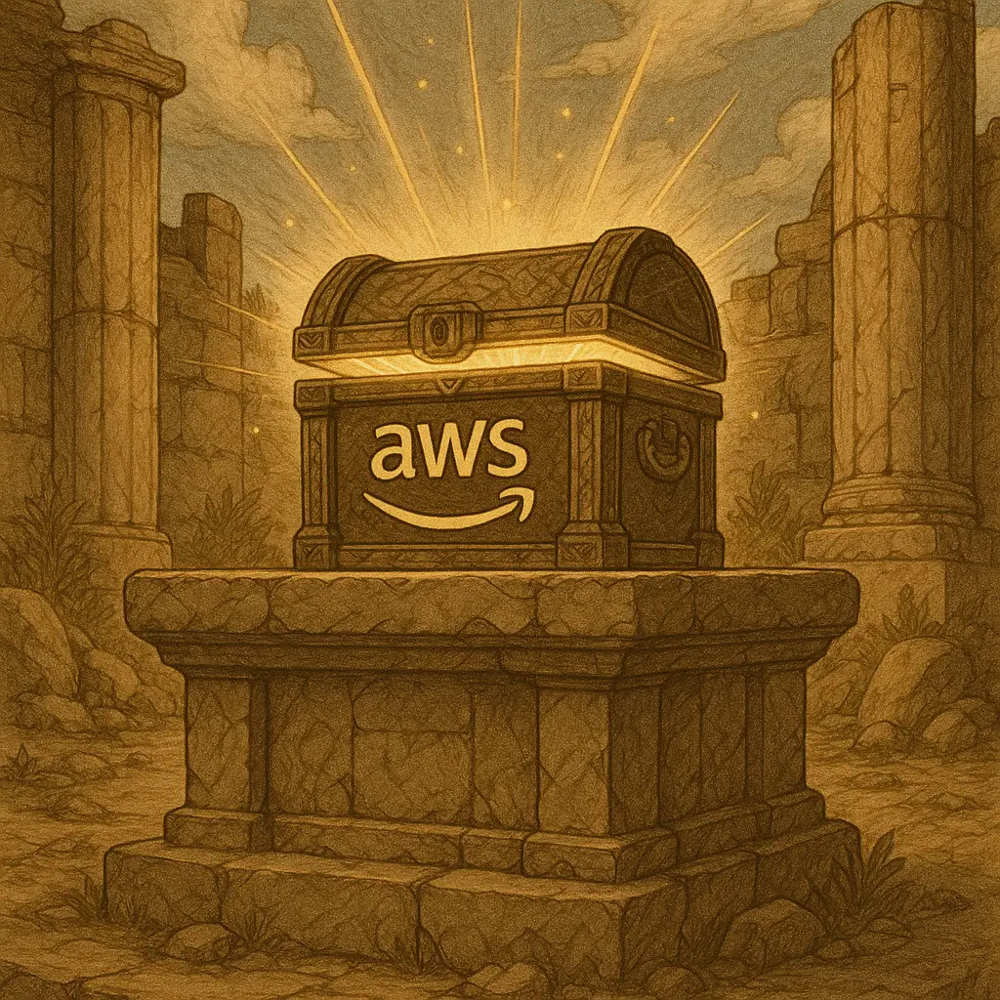

# 🧰 AWS Developer Toolbox

<div align="center">
  
</div>

Essential tools to accelerate your AWS development journey. These carefully selected tools will enhance your productivity and make working with AWS services more efficient.

## 🏗️ Core AWS Tools

### AWS Account
Your gateway to the cloud with a **generous Free Tier** that lets you explore and build without upfront costs. The Free Tier includes:
- 750 hours of EC2 t2.micro instances
- 5GB of S3 storage
- 25GB of DynamoDB storage
- And much more for 12 months

### AWS CLI
The **entry point to AWS** - your command-line interface for managing AWS services. Essential for automation, scripting, and quick resource management.

```bash
# Install and configure
aws configure
aws s3 ls
aws ec2 describe-instances
```

### AWS SDKs
**Your programming language gives you access to AWS**. Native SDKs available for Python (boto3), JavaScript, Java, .NET, Go, and more.

```python
import boto3
s3 = boto3.client('s3')
```

### AWS Toolkit for IDEs
**Shortcuts from your favorite IDE to AWS**. Download the AWS extension for your IDEA (JetBrains, VSCode, Kiro...) 

## 🤖 AI-Powered Development

### Amazon Q Developer Command CLI (Q CLI)
Your AI coding companion that understands AWS services and can help generate code, explain concepts, and troubleshoot issues directly from your terminal.

```bash
q chat "How do I create an S3 bucket with CDK?"
```

### Kiro
**IDE for AI coding with spec-driven development**. Build applications by describing what you want, and let AI generate the implementation.

## 🏗️ Infrastructure as Code

### AWS CDK (Cloud Development Kit)
**IaC in your favorite programming language**. Define cloud infrastructure using familiar programming languages instead of YAML or JSON.

```typescript
const bucket = new s3.Bucket(this, 'MyBucket', {
  versioned: true,
  encryption: s3.BucketEncryption.S3_MANAGED
});
```

## 📚 MCP Servers for Enhanced AI Assistance

### AWS Documentation MCP Server
Get instant access to AWS documentation and best practices through your AI assistant.

### AWS CDK MCP Server
Enhanced CDK support with construct recommendations and pattern suggestions.

### AWS Pricing MCP Server
Real-time pricing information and cost optimization suggestions.

### AWS Security Checklist
A short document that gives you the guidance you were looking for to secure your AWS account. [Link](https://d1.awsstatic.com/whitepapers/Security/AWS_Security_Checklist.pdf?did=wp_card&trk=wp_card)

## 🚀 Getting Started

1. **Set up your AWS Account** and explore the Free Tier
2. **Install AWS CLI** and configure your credentials
3. **Choose your SDK** based on your preferred programming language
4. **Try Q CLI** for AI-assisted development
5. **Learn CDK** to manage infrastructure as code

These tools work together to create a powerful development environment that scales with your AWS journey from beginner to expert.
